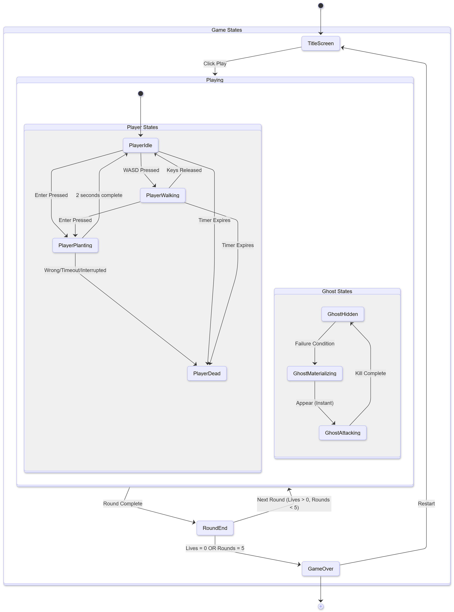
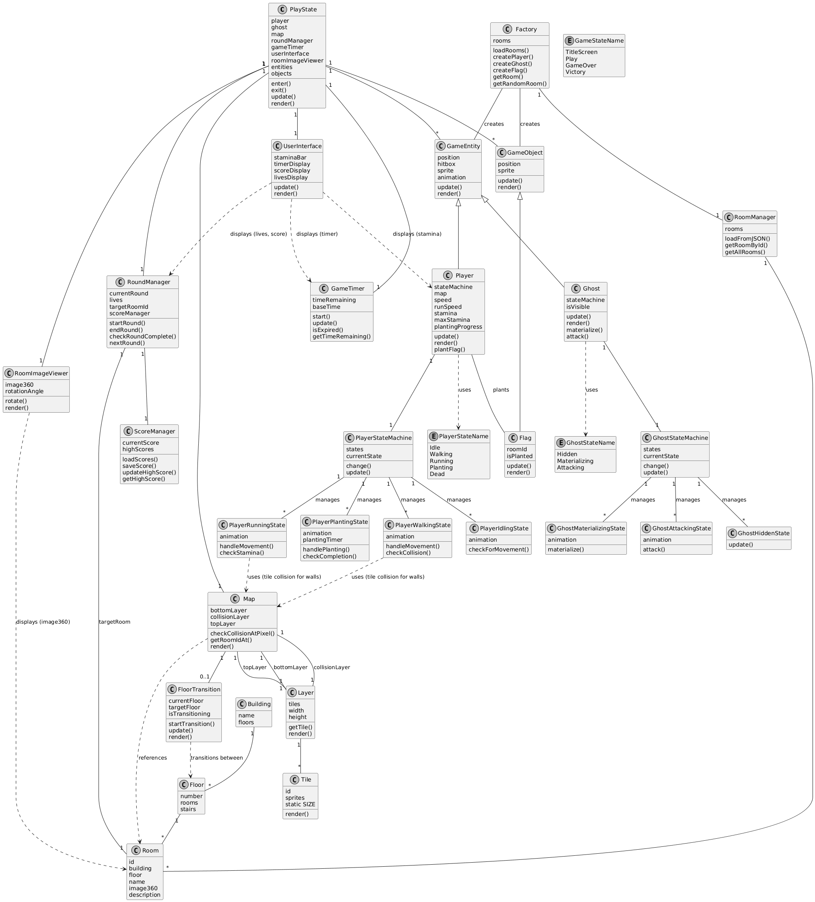
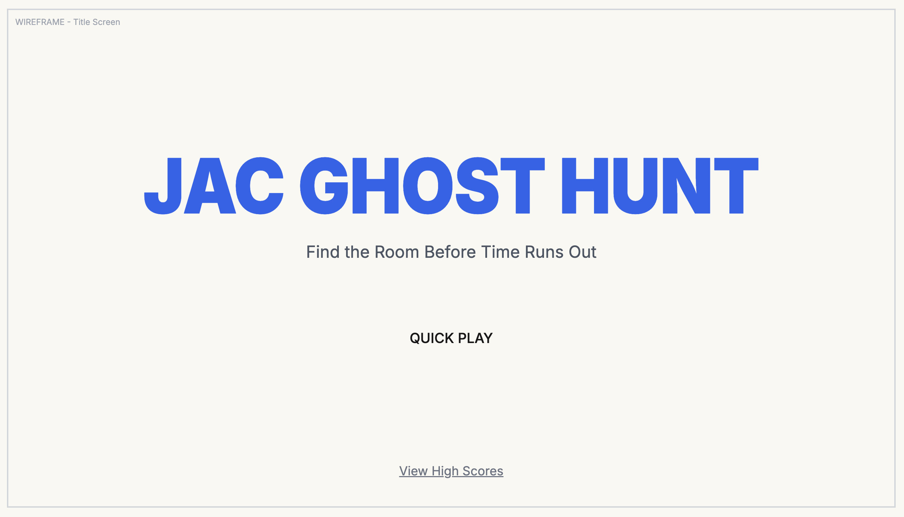
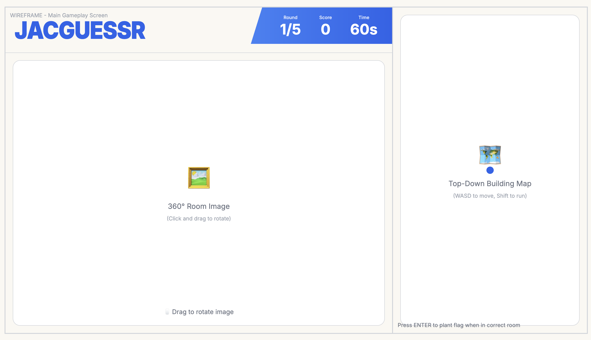
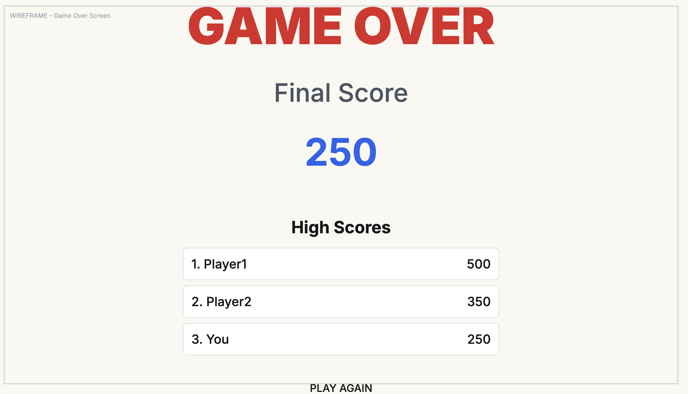
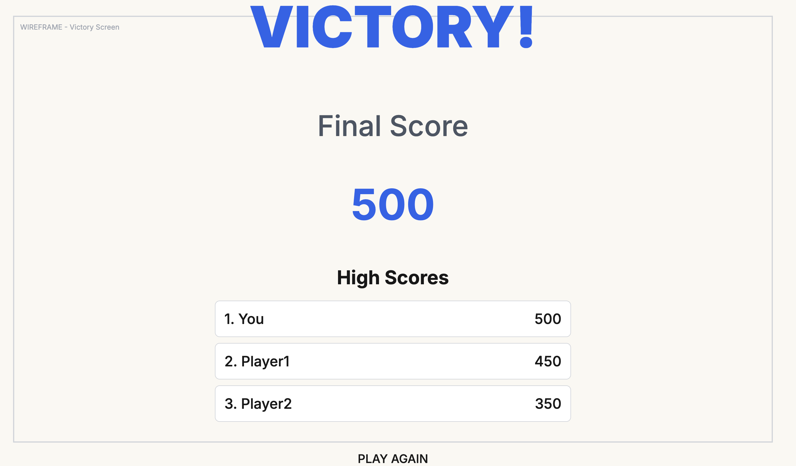

# JAC Ghost Hunt

## Description

JAC Ghost Hunt is a horror-themed location guessing game set in John Abbott College. Players view a 360° photograph of a random room on campus and must navigate a 2D top-down map of the building to locate and mark the correct room before being caught by a pursuing ghost. The game combines spatial awareness, campus knowledge, and time pressure into an educational yet thrilling survival experience.

The game architecture uses a state machine pattern for both player and ghost entities, allowing for smooth transitions between different behaviors. The player can be in one of five states: Idle, Walking, Running, Planting, or Dead. The ghost operates through three states: Hidden, Materializing, and Attacking. The game implements a hybrid collision system that uses tile-based collision for wall detection (similar to Pokemon-style games) and hitbox-based collision for entity interactions (similar to Zelda-style games).

The map system is built with a three-layer architecture: a bottom layer for floor graphics, a collision layer for wall detection, and a top layer for decorative elements. Rooms are organized hierarchically within buildings and floors, with each room containing metadata such as building name, floor number, room name, 360° image, and description. The game uses a RoomManager to load room data from JSON configuration files, with entities created directly by the PlayState

Players progress through up to five rounds, with each round ending in either a RoundEnd state (for successful completion) or GameOver state (for failure). The game tracks high scores using a ScoreManager that persists data to LocalStorage.

## Gameplay

Players begin the game by selecting **Quick Play** from the title screen. The system randomly selects a building and room and displays a **360° image** of that room on the left side of the screen. On the right side, the player sees a **top-down canvas map** of the entire building, including multiple floors.

The player spawns on **Floor 1**. A timer immediately begins, starting at **60 seconds** for Round 1 and decreasing slightly each round to increase difficulty. Using WASD, the player navigates hallways, rooms, and stairs to travel between floors. The player can hold **Shift** to run faster, which consumes stamina. The stamina bar depletes while running and regenerates when the player is idle or walking normally. The player cannot run when stamina is depleted. The player rotates the 360° room photo to identify visual clues such as windows, wall colors, or classroom objects.

When the player moves between floors using stairs, the floor transition is quick and smooth. When going up stairs, the next floor appears layered on top of the current floor. When going down stairs, the lower floor transitions up to become visible. The player's position is maintained relative to the stairs during these transitions.

When the player believes they are standing in the correct room on the map, they press **Enter** to plant a flag. Planting a flag requires **two full seconds**, during which the player is vulnerable. If the flag is placed in the correct room, the round ends successfully and the player earns **100 points** before moving to the next round.

If the flag is planted in the wrong room, the timer hits zero during planting, or the player fails to plant before time runs out, a ghost materializes instantly and kills the player. The death animation plays, and the player loses one life before automatically starting the next round.

After all **five rounds** are completed or all three lives are lost the game ends and displays the final score and high scores stored locally on the device.

## Requirements

### Game Initialization

1. The system shall display a title screen on startup.
2. The system shall allow the user to begin the game by selecting “Play.”
3. The system shall randomly select a building and room for the first round.
4. The system shall load a 360° image of the selected room.
5. The system shall load the multi-floor map of the selected building.
6. The system shall spawn the player at a defined starting location on Floor 1.

### Gameplay Loop

7. The system shall start a countdown timer of 60 seconds for Round 1.
8. The system shall decrease the timer amount for each subsequent round.
9. The user shall move their character using WASD. The user may hold Shift to run faster, consuming stamina.
10. The system shall prevent the player from passing through walls or locked areas.
11. The user shall change floors by moving onto stairs.
12. The system shall display quick floor transitions when the player moves between floors. When going up, the next floor appears above the current floor. When going down, the lower floor transitions up to become visible.
13. The user shall rotate the 360° photograph with the mouse.
14. The user shall press Enter to plant a flag.
15. The system shall require a 2-second planting duration to complete the flag action.
16. The system shall check whether the flag was planted in the correct room.
17. The system shall end the round immediately if the planted flag is correct.
18. The system shall award 100 points for a correct answer.
19. The system shall end the round and deduct one life if the flag is incorrect.
20. The system shall end the round and deduct one life if the timer reaches zero.
21. The system shall end the round and deduct one life if the user is killed while planting.
22. The system shall display the score, timer, and lives visually at all times.
23. The system shall display a stamina bar that depletes while the player is running and regenerates when the player is idle or walking.
24. The system shall prevent the player from running when stamina is depleted.
25. The system shall maintain the player's position relative to stairs during floor transitions.

### Ghost Logic

26. The ghost shall remain invisible during normal gameplay.
27. The ghost shall appear only when the user fails the round (wrong room or timeout).
28. The ghost shall kill the player instantly when it appears.
29. The system shall play a death animation upon ghost kill.

### Round Management

30. The system shall track the number of completed rounds.
31. The system shall advance automatically to the next round after each round ends.
32. The system shall select a new random room for each round.
33. The system shall end the game after five total rounds.

### Win/Loss Conditions

34. The user shall lose one life upon being killed by the ghost.
35. The user shall start the game with three lives.
36. The system shall end the game when all lives are lost.
37. The system shall display a Game Over screen when the game ends.
38. The system shall display the final score on the Game Over screen.

### Persistence

39. The system shall save the user's highest scores using LocalStorage.
40. The system shall load saved scores when the game starts.
41. The system shall allow the user to view high scores from the title screen.

### Architecture & State Management

42. The system shall implement a PlayerStateMachine to manage player state transitions.
43. The system shall implement player states: PlayerIdlingState, PlayerWalkingState, PlayerRunningState, PlayerPlantingState, and PlayerDead.
44. The system shall implement a GhostStateMachine to manage ghost state transitions.
45. The system shall implement ghost states: GhostHiddenState, GhostMaterializingState, and GhostAttackingState.
46. The system shall use a hybrid collision system: tile-based collision for wall detection and hitbox-based collision for entity interactions.
47. The system shall implement a Map with three layers: bottomLayer (floor graphics), collisionLayer (wall detection), and topLayer (decorative elements).
48. The system shall use a RoomManager to load room data from JSON configuration files.
49. The system shall implement a FloorTransition class to handle smooth transitions between floors.

### Map & Room System

50. The system shall organize rooms hierarchically: Building → Floor → Room.
51. The system shall store room metadata including: id, building name, floor number, room name, 360° image path, and description.
52. The system shall use a Layer class to manage tile data with width, height, and tile retrieval methods.
53. The system shall use a Tile class with static SIZE property for consistent tile rendering.
54. The system shall provide Map methods: checkCollisionAtPixel() for collision detection and getRoomIdAt() for room identification.

### Game States

55. The system shall implement a RoundEnd state that displays after each round completion.
56. The system shall transition from RoundEnd to Playing if lives > 0 and rounds < 5.
57. The system shall transition from RoundEnd to GameOver if lives = 0 or rounds = 5.
58. The system shall implement a Victory state for successful game completion (all 5 rounds completed with lives remaining).
59. The system shall transition from RoundEnd to Victory when all 5 rounds are completed successfully.

### Player State Transitions

60. The system shall transition PlayerIdle to PlayerWalking when WASD keys are pressed.
61. The system shall transition PlayerWalking to PlayerIdle when movement keys are released.
62. The system shall transition PlayerIdle or PlayerWalking to PlayerRunning when Shift is pressed and stamina > 0.
63. The system shall transition PlayerRunning to PlayerWalking when Shift is released or stamina is depleted.
64. The system shall transition PlayerRunning to PlayerIdle when all movement keys are released.
65. The system shall transition any player state to PlayerPlanting when Enter is pressed.
66. The system shall transition PlayerPlanting to PlayerIdle after 2 seconds if planting is successful.
67. The system shall transition PlayerPlanting to PlayerDead if the flag is planted in the wrong room, timer expires, or planting is interrupted.
68. The system shall transition any player state to PlayerDead when the game timer expires.
69. The system shall regenerate stamina when the player is in PlayerIdle or PlayerWalking states.
70. The system shall drain stamina when the player is in PlayerRunning state.

### Ghost State Transitions

71. The system shall keep the ghost in GhostHidden state during normal gameplay.
72. The system shall transition GhostHidden to GhostMaterializing when a failure condition occurs (wrong room, timeout, or interrupted planting).
73. The system shall transition GhostMaterializing to GhostAttacking instantly when the ghost appears.
74. The system shall transition GhostAttacking back to GhostHidden after the kill animation completes.
75. The system shall make the ghost visible only during GhostMaterializing and GhostAttacking states.

### Score & Timer Management

76. The system shall use a ScoreManager class separate from RoundManager to handle score operations.
77. The system shall use a GameTimer class with methods: start(), update(), isExpired(), and getTimeRemaining().
78. The system shall track baseTime and timeRemaining in the GameTimer.
79. The system shall use RoundManager to coordinate between ScoreManager, GameTimer, and target room selection.

### UI Components

80. The system shall use a RoomImageViewer class to display and rotate 360° room images.
81. The system shall track rotationAngle in RoomImageViewer for mouse-based rotation.
82. The system shall use a UserInterface class to display staminaBar, timerDisplay, scoreDisplay, and livesDisplay.
83. The system shall update UI components each frame through UserInterface.update() and UserInterface.render() methods.

### State Diagram

### Class Diagram

### Wireframes

#### Title Screen

#### Gameplay Screen

#### Round End Screen

#### Game Over Screen

#### Victory Screen

### Assets

Assets and textures will be sourced from [Modern Interiors](https://limezu.itch.io/moderninteriors).

#### Images

For the 360° images, panoramic photos will be taken of each room at John Abbott College.

#### Fonts

-   **Anton** (Anton Regular) - Used for the game logo/title with custom styling (letter-spacing: -1px, font-weight: 900, vertical scale: 1.1)
-   **Roboto** (Roboto Regular, Roboto Bold) - Used for UI elements, score display, timer, and button text

#### Sounds

Sound effects will be sourced from [Freesound.org](https://freesound.org), a community-driven database of free sound effects. The game will require the following sound effects:

-   **Footsteps** - Walking and running sounds for player movement
-   **Door sounds** - Opening and closing door effects
-   **Stairs** - Footstep sounds for ascending/descending stairs
-   **Ghost materializing** - Horror-themed sound for ghost appearance
-   **Ghost attack** - Sound effect for when the ghost kills the player
-   **Flag planting** - Success sound when flag is placed correctly
-   **Round complete** - Sound for successful round completion
-   **Game over** - Sound for game failure
-   **Victory** - Sound for completing all rounds successfully
